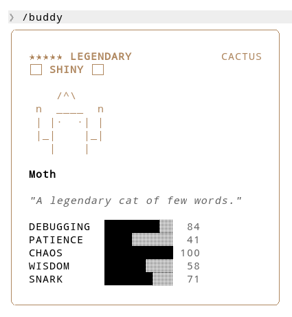

Claude Code Buddy
=================

Shiny Legendary Generator
-------------------------

Brute-force search for random **Shiny + Legendary** buddy pets in Claude Code.

How it works
------------

A buddy's appearance (species, rarity, shiny, etc.) is deterministically derived
from ``hash(userId + SALT)``.  This script rapidly tries random salts (or random
userIDs) until it finds combinations that produce a **Shiny Legendary** buddy.

Usage
-----

Local::

   node shiny-legendary.js

Remote (no clone)::

   curl -sL https://raw.githubusercontent.com/vimuxx/claude-code-buddy/refs/heads/master/shiny-legendary.js | node --input-type=module

Output
------

.. code-block:: text

   +=====================================+
   | Claude Code Buddy - Shiny Legendary |
   +=====================================+

   Found 5 SALT(s)   with fd1da1ed4222fda (~/.claude.json) in 49,854 attempts:

     lj8c4hdgbmzo4uc
     1gd8eddbjap7tak
     75uyzaswsx8bqjt
     48y3ig5cj7gqcr3
     1iuezd9qf904ejv

   Found 5 userID(s) with friend-2026-401 (2.1.88 default) in 93,545 attempts:

     025878c8b809f28cc81f4c5fcf267c92e6e00cc17794eb7953c00c93d59875d5
     a1eaba8078f2c4e53e1dd1b76419afcb11578e634cfab26173577c85682eb3c1
     152e2fe14874d21cf0e0e0a825b4fdd90e9bb519659fc35c52391e69b2adae00
     d38caaa35daeb81a3475bb7ca825f6d837eaf9b24dc2d93165cadfcde65e2ee8
     ede2c3a58ad146f9774373b0f7d6688015c6430c3fdeb85eb94e8c6b7a96a41c

Then
----

For **Auth** account: pick one SALT then replace the hardcoded ``"friend-2026-401"`` in Claude Code binary.

For **Local** account: pick one userID then replace ``"userID"`` in ``~/.claude.json``.

Buddy is derived from ``userId + SALT``.
